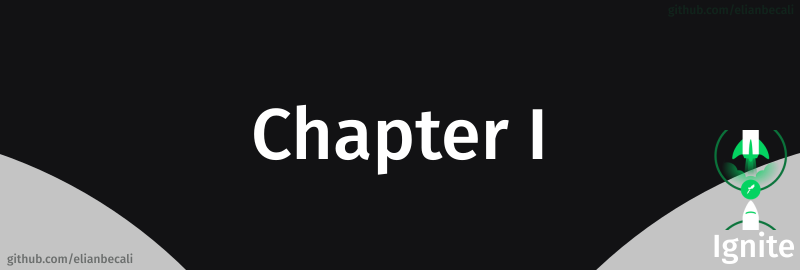

# 

<!--ts-->
   * [Projeto](#projeto)
   * [Módulos](#módulos)
      * [Fundamentos do ReactJS](#fundamentos-do-reactjs)
   * [Desafios](#-layout)
   
<!--te-->

## Projeto

[Github explorer](/projetos/01-github-explorer)

## Módulos

### Fundamentos do ReactJS

Nesse módulo criamos a estrutura base de uma aplicação React utilizando ferramentas como Webpack, Babel, Webpack Dev server, SASS, Source Maps, Fast Refresh e vimos conceitos importantes do React como componentes, propriedades, estados e hooks além de aplicar o TypeScript no nosso projeto para adicionar tipagem estática à aplicação.

## Desafios

### Conceitos do React

Nesse desafio, criamos uma aplicação para treinar o que aprendeu até agora no ReactJS. Essa será uma aplicação onde o principal objetivo é uma pequena aplicação de atividades a fazer, para treinar um pouco mais sobre manipulação do estado no React.

 

[Conceitos do React](/desafios/desafio-conceitos-do-react) 

### Componentizando a aplicação

Nesse desafio dividimos uma aplicação em componentes afim de isolar as responsabilidades e facilitar a manutenção do código.

 

[Componentizando a aplicação](/desafios/watchme) 
