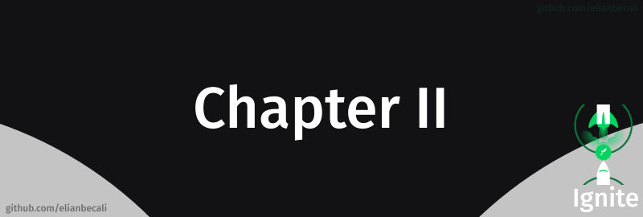

# 

<!--ts-->
   * [Projeto](#projeto)
   * [Módulos](#módulos)
      * [Primeira aplicação web com ReactJS](#primeira-aplicação-web-com-reactjs)
   * [Desafios](#-layout)
   
<!--te-->

## Projeto

[Dt money](/Chapter%20II/projetos/)

## Módulos

### Primeira aplicação web com ReactJS

Nesse módulo construimos uma aplicação front-end web completa utilizando conceitos e ferramentas importantes do ecossistema React como Styled Components, MirageJS, Context API, hooks, Axios e muito mais.

## Desafios

### Criando um hook de carrinho de compras

Nesse desafio criamos um hook para gerenciar um carrinho de compras.

 

[Rocketshoes](/Chapter%20II/desafios) 

### Refactoring de classes e TypeScript

Nesse desafio migramos uma aplicação de Javascript e Class Components para Typescript e Function Components.

 

[Refactoring de classes](/Chapter%20II/desafios) 
