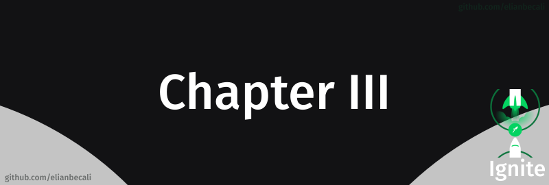

# 

<!--ts-->
   * [Projeto](#projeto)
   * [Módulos](#módulos)
      * [Fundamentos do Next.js](#fundamentos-do-nextjs)
      * [Back-end no front-end](#back-end-no-front-end)
      * [Front-end JAMStack](#front-end-jamstack)
   * [Desafios](#desafios)
   
<!--te-->

## Projeto

[ig.news](/Chapter%20III/projetos/)

## Módulos

### Fundamentos do Next.js

Nesse módulo foi apresentado como o Next.js transforma a nossa maneira de desenvolver aplicações front-end e aprendemos conceitos importantes como SSR e SSG.

### Back-end no front-end

Durante esse módulo entendemos como o front-end se transformou nos últimos anos com a possibilidade de termos funções back-end (serverless) executando em um ambiente front-end.

### Front-end JAMStack

É muito comum o desenvolvimento de aplicações front-end que não estão conectadas a um único back-end hoje em dia, por isso, nesse módulo aprendemos o conceito de JAMStack e como conectar nosso front-end com um CMS.

## Desafios

### Criando uma aplicação do zero

Nesse desafio criamos do zero uma aplicação de um blog com Prismic CMS a partir de um layout do Figma.

 

[Spacetraveling](/Chapter%20III/desafios) 

### Adicionado features ao blog

Nesse desafio apenas adicionamos novas features ao projeto desenvolvido no desafio anterior.

 

[Spacetraveling](/Chapter%20III/desafios) 
