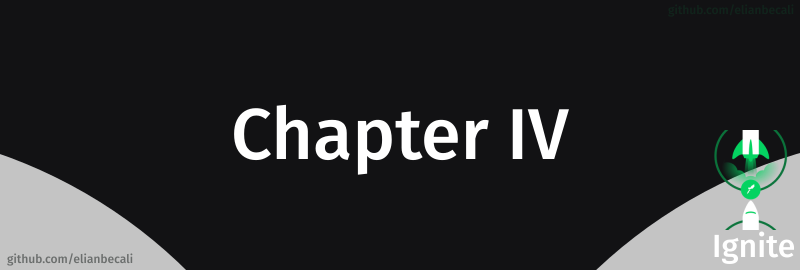

# 

<!--ts-->
   * [Projeto](#projeto)
   * [Módulos](#módulos)
      * [Construindo interfaces do futuro](#construindo-interfaces-do-futuro)
      * [Data fetching e cache local](#data-fetching-e-cache-local)
      * [Autenticação e autorização](#autenticação-e-autorização)
   * [Desafios](#desafios)
   
<!--te-->

## Projeto

[Dashgo](/Chapter%20IV/projetos/)

## Módulos

### Construindo interfaces do futuro

Nesse módulo criamos uma interface de um painel administrativo contendo fluxo de autenticação, dashboard, listagem e cadastro usando Chakra UI no Next.js.

### Data fetching e cache local

Nesse módulo utilizamos o React Query para melhorar a experiência de uso da nossa aplicação criando uma camada de cache de dados entre o front-end e back-end.

### Autenticação e autorização

Nesse módulo criamos um processo completo de autenticação, autorização e refresh token dentro do React com Next.js permitindo controlar o acesso à rotas e componentes tanto no client-side quando server-side.

## Desafios

### Upload de imagens

Nesse desafio realizamos o upload e listagem de imagens utilizando React Query, React Hook Form e Chakra UI.

 

[Ignite reactjs upload de imagens](/Chapter%20IV/desafios) 

### Interface com Chakra UI

Nesse desafio desenvolvemos toda a interface de uma aplicação utilizando como base o Chakra UI.

 

[Worldtrip](/Chapter%20IV/desafios) 
