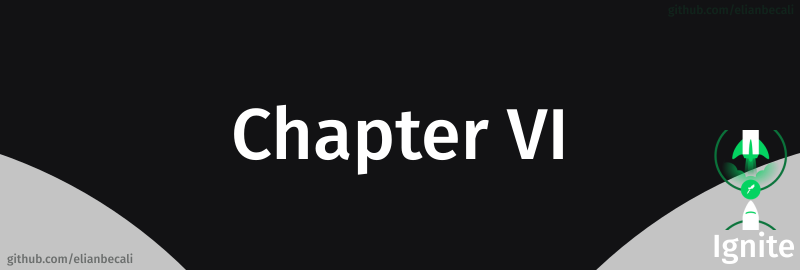

# 

<!--ts-->
   * [Módulos](#módulos)
      * [Estratégias de deploy no ReactJS](#estratégias-de-deploy-no-reactjs)
   * [Desafio](#desafio)
   
<!--te-->

## Módulos

### Estratégias de deploy no ReactJS

Nesse módulo aprendemos as principais estratégias de deploy de uma aplicação ReactJS com e sem Next.js utilizando serviços como Netlify e Vercel principalmente, mas também conhecemos outras opções para projetos mais complexos.

## Desafio

### Deploy da aplicação

Nesse desafio colocamos uma aplicação em produção usando das abordagens aprendidas durante o capítulo. 

[e-ignews.vercel.app](https://e-ignews.vercel.app/) 
